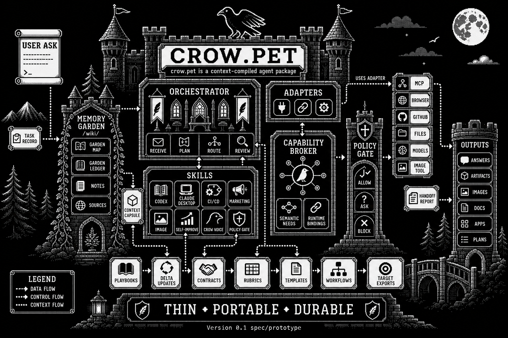

# crow.pet



**crow.pet is a context-compiled agent package.**

**Version 0.1 spec/prototype. Not a packaged runtime yet.**

crow.pet is a markdown package for context engineering: deciding what gets written, retrieved, compressed, isolated, evaluated, updated, and reused by an LLM harness.

An LLM harness points at this folder and uses its context window as the compiler. The source language is portable markdown: skills, adapters, templates, rubrics, policies, examples, playbooks, and bounded memory. The compiled output is agent behavior: task records, delegated work, verification, artifacts, and durable learning.

## What Works Today

- Markdown package surface: skills, adapters, templates, contracts, rubrics, Memory Garden conventions, and capability-binding patterns.
- Canonical skills for orchestration, delegation, CI/CD, marketing, image generation, self-improvement, Crow Voice, and policy gate decisions.
- A SPEC.MD loop where crow.pet can clarify a build request, write a bounded spec, and hand it to a harness or agent.
- A Markdown Work Queue pattern for turning approved specs into builder-ready work items.
- A Skill Architect pattern for choosing whether a skill should be inline, reference-backed, script-backed, composed, or manual-gated before implementation.
- Runtime boundaries through adapters for harnesses, tools, memory, channels, LLMs, targets, and orchestration patterns.
- Simulated traces showing a marketing task, the Work Queue spec-to-handoff loop, and composed skill architecture.

## What Does Not Work Yet

- No packaged runner, installer, daemon, CLI, or hosted service.
- No automatic runtime enforcement for schemas, policy decisions, or rubric scores.
- No automatic runner for composed skill pipelines or stage handoffs.
- No claim that every target adapter is currently tested against its upstream tool.
- No vector database, embedding index, or hidden retrieval layer.

## Context Engineering Model

crow.pet uses six context operations:

| Operation | crow.pet surface |
| --- | --- |
| Writing / offloading | Task records, handoff reports, artifacts, playbooks, and Memory Garden notes. |
| Retrieval | Skill-selected context capsules and bounded Memory Garden slices. |
| Reduction / compaction | Crow Voice, summaries, evaluation notes, and compressed handoffs. |
| Isolation | Specialist skills, subagents, adapters, and separate context windows. |
| Evaluation | Contracts, rubrics, policy decisions, and reflection notes. |
| Update | Policy-gated playbook deltas, memory updates, examples, and skill proposals. |

## Status

Status reflects the markdown package surface, not runtime enforcement.

| Primitive | Status | Purpose |
| --- | --- | --- |
| Skills | Implemented | Runtime-neutral behaviors. |
| Adapters | Implemented | Runtime, tool, channel, memory, model, target, and capability translation. |
| Contracts | Implemented | Acceptance boundaries for skills and adapters. |
| Rubrics | Implemented | Evaluation criteria for result quality. |
| Memory Garden | Implemented | Durable knowledge layer at `/wiki/`. |
| Crow Voice | Implemented | Token-efficient harness communication. |
| Task records | Partial | Common form for incoming work; template exists, enforcement is manual. |
| Context capsules | Partial | Bounded context selected from memory or source files; selection is skill-curated. |
| Handoff reports | Partial | Common form for completed delegated work; shown in the golden trace. |
| Policy gate | Partial | Permission checkpoint with decision axes and precedence rules. |
| Capability Broker | Partial | Semantic ability binding before the concrete adapter is known. |
| SPEC.MD | Partial | Build contract produced after clarification and before harness handoff. |
| Work Queue | Partial | Markdown lifecycle record between approved spec and builder handoff. |
| Skill Architect | Partial | Execution-shape decision before creating, changing, or composing skills and workflows. |
| Playbooks | Partial | Reusable strategies and mistakes with helpful/harmful counters. |
| Delta updates | Partial | Evidence-backed proposed changes to memory, playbooks, skills, rubrics, or policy. |
| Packaged runner | Planned | Future executable harness or CLI. |

## Package Shape

| Layer | Status | Purpose |
| --- | --- | --- |
| `skills/` | Implemented | Canonical runtime-neutral behaviors and workflows. |
| `adapters/` | Implemented | Runtime, tool, channel, memory, capability binding, and target translation. |
| `skills/*/templates/` | Partial | Common intermediate forms such as task records and handoffs. |
| `contract.md` and `rubric.md` | Implemented | Acceptance checks and evaluation criteria. |
| `playbooks/` | Partial | ACE-inspired reusable lessons and counters. |
| `templates/` | Partial | Shared templates such as delta updates. |
| `templates/SPEC.md` | Partial | Reusable contract for spec-first builds. |
| `templates/work-item.md` | Partial | Reusable lifecycle record for queued builder work. |
| `templates/skill-architecture.md` | Partial | Reusable plan for skill execution shape, context budget, handoffs, and adapter mapping. |
| `templates/stage-handoff.md` | Partial | Compact stage-to-stage contract for composed workflows. |
| `examples/` | Partial | Public-safe golden trace material. |
| `wiki/` and `raw/` | Implemented | Memory Garden inputs for context compilation. |
| `outputs/` | Planned | Generated artifacts and synthesized results. |
| `assets/` | Implemented | Images and visual assets used by the package. |
| `plans/` | Implemented | Adoption and migration plans. |

## Core Loop

The v0.1 golden trace is:

```text
user ask
-> task record
-> selected skill
-> context capsule
-> adapter binding
-> artifact
-> reflection / evaluation
-> proposed delta update
-> policy decision
-> handoff report
```

See `examples/demo-marketing-trace/`.

## Progressive Disclosure

Load the smallest useful unit first.

Start with root `SKILL.md` files. Load workflows, templates, references, contracts, rubrics, examples, policies, and playbooks only when the selected skill says the task needs them.

Use `skills/skill-map.md` as a derived semantic routing map. The source of truth remains the root `SKILL.md` files.

Use context capsules for task context. Do not bulk-load memory, wiki folders, transcripts, or raw sources by default.

## Capability Binding

When a task needs an ability before it knows the concrete tool, use the Capability Broker (`adapters/patterns/capability-broker.md`).

Examples include `web_research`, `browser_control`, `repo_read`, `visual_understanding`, and `external_write`.

Prefer specific APIs, CLIs, connectors, and tool adapters before generic browser or desktop automation.

## SPEC.MD Build Loop

When a user wants something built and the output contract is not clear yet, route to `crow-pet-spec-writer`.

The loop is:

```text
ask clarifying question
-> write SPEC.MD
-> bind capabilities
-> hand to harness / agent
-> verify against spec
-> handoff report
```

`SPEC.MD` is the compact build contract. It records the goal, output, constraints, capability needs, selected builder, acceptance criteria, verification, and policy notes.

## Work Queue

When an approved `SPEC.MD` should be handed to a builder, route to `crow-pet-work-queue`.

The queue loop is:

```text
SPEC.MD
-> markdown work item
-> capability binding
-> harness / agent handoff
-> verification
-> handoff report
```

The work item tracks lifecycle, assignment, selected builder, selected adapters, artifacts, and evidence. It is not a background runner, daemon, GitHub Issue integration, or Linear integration.

See `examples/demo-work-queue-trace/`.

## Skill Architecture

When a request creates or changes a skill, repeated workflow, or multi-agent pattern, route to `crow-pet-skill-architect` before implementation.

The execution shapes are:

```text
inline
-> thin-references
-> deterministic-script
-> composed-pipeline
-> manual-side-effect
```

The point is not to make everything more elaborate. It is to choose the lightest shape that preserves portability, verification, and token discipline.

Canonical crow.pet records portable semantics such as isolation, handoff strategy, side effects, dynamic context, and context budget. Target adapters map those semantics to Codex subagents, Claude-style forked context, browser automation, shell scripts, MCP tools, or other harness features.

See `examples/demo-skill-architecture-trace/`.

## Playbook Evolution

crow.pet borrows ACE's useful learning shape without depending on ACE as a runtime package:

```text
Generator -> Reflector -> Curator -> Playbook Delta
```

Learning must be small, evidence-backed, and policy-gated. Whole-file rewrites require explicit approval.

## Memory Garden

The Memory Garden (`/wiki/`) is crow.pet's Karpathian LLM Wiki. The Garden Map is `wiki/indices/master_index.md`; the Garden Ledger is `wiki/indices/system_log.md`.

Markdown is the map, not the warehouse. Use indexes, source manifests, and context capsules. Keep raw sources and full transcripts out of hot context unless the task requires them.

Use Obsidian through adapters. Do not make Obsidian syntax a core memory requirement.

## More

- `COMPILATION.md`: context compilation contract.
- `PUBLIC_EXPORT.md`: public safety rules.
- `INVARIANTS.md`: thin, portable, durable constraints.
- `CHANGELOG.md`: release notes.
- `LICENSE`: MIT license.
