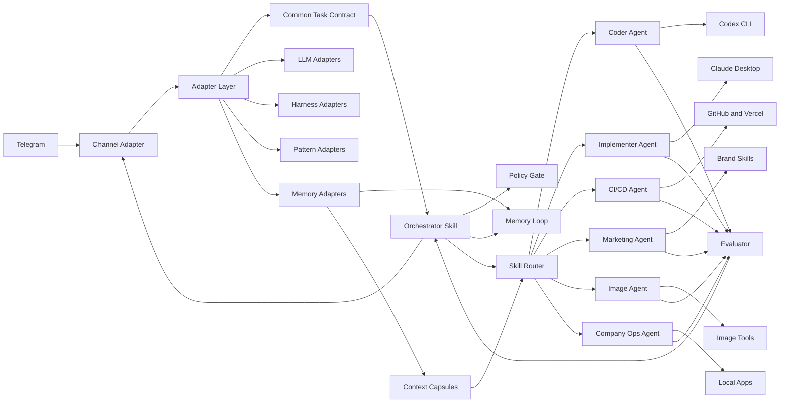

# PRD: crow.pet Agent OS Software Package

## Status

Draft v0.1.

Owner: Software package maintainer.

Target platform: Local macOS agent runtime.

Primary interface: Telegram.

Primary deliverable: Runtime-neutral skills, adapters, and markdown operating files.

## Source Inputs

- [Karpathy-inspired agent rules](https://github.com/forrestchang/andrej-karpathy-skills)
- [Karpathy LLM Wiki pattern](https://gist.github.com/karpathy/442a6bf555914893e9891c11519de94f)
- [Anthropic skills repository](https://github.com/anthropics/skills)
- [AGENTS.md open format](https://agents.md/)
- [Codex Agent Skills](https://developers.openai.com/codex/skills)
- [ChatGPT custom GPTs](https://help.openai.com/en/articles/8554397-creating-a-gpt%3F.avif)
- [ChatGPT Projects](https://help.openai.com/en/articles/10169521-using-projects-inchatgpt)
- [GPT Actions](https://developers.openai.com/api/docs/actions/introduction)
- [Cursor rules](https://docs.cursor.com/context/rules)
- [VS Code AI customization](https://code.visualstudio.com/docs/copilot/customization/overview)
- [Windsurf memories and rules](https://docs.windsurf.com/windsurf/cascade/memories)
- [Cline skills](https://docs.cline.bot/customization/skills)
- [Gemini CLI context files](https://google-gemini.github.io/gemini-cli/docs/cli/gemini-md.html)
- [Devin skills](https://docs.devin.ai/product-guides/skills)
- [Provided JRPG infographic reference](https://github.com/infolog-io/Monet/blob/main/docs/assets/monet-pixel-jrpg-infographic.png)
- [OpenClaw architecture overview](https://openclawdoc.com/docs/getting-started/what-is-openclaw/)
- [OpenClaw agents overview](https://openclawdoc.com/docs/agents/overview/)
- [OpenClaw skills overview](https://openclawdoc.com/docs/skills/overview/)
- [OpenClaw Telegram integration](https://openclawdoc.com/docs/channels/telegram/)
- [OpenClaw security overview](https://openclawdoc.com/docs/security/overview/)
- [Hermes persistent memory](https://hermes-agent.nousresearch.com/docs/user-guide/features/memory)
- [Hermes memory providers](https://hermes-agent.nousresearch.com/docs/user-guide/features/memory-providers/)
- [Hermes context files](https://hermes-agent.nousresearch.com/docs/user-guide/features/context-files)
- [Hermes SOUL.md behavior](https://hermes-agent.nousresearch.com/docs/user-guide/features/personality)
- [OpenClaude memory architecture](https://github.com/seanchiuai/openclaude)
- [Obsidian Skills](https://github.com/kepano/obsidian-skills)

## Summary

Build crow.pet, a modular Agent OS software package.

OpenClaw is one supported adapter target.

The system lets the owner command a Mac mini from Telegram.

It can delegate work to Claude Desktop, Codex, and other local applications.

It can launch subagents for coding, implementation, CI/CD, marketing, image generation, and company operations.

The MVP uses adapters, skills, markdown contracts, rubrics, and local shell wrappers.

Obsidian is supported as an optional adapter.

The system must ask less often over time.

It must do this through explicit policies, memory, evaluations, and self-improvement loops.

## Product Thesis

crow.pet becomes the thin system.

Skills become the fat layer.

Adapters translate host runtimes, LLMs, harnesses, and patterns.

Adapters must not change the skill folder contract.

The orchestrator routes work, enforces policy, records memory, and verifies outcomes.

Specialized skills hold role context, examples, contracts, and rubrics.

The system improves itself by converting repeated wins into reusable skills.

It converts repeated failures into stricter checks or clearer policies.

## Problem

The owner has multiple AI tools on a Mac mini.

These tools are trapped behind separate interfaces.

Claude Desktop, Codex, image tools, browsers, terminals, and company apps lack one shared command plane.

The owner wants to dispatch work remotely through Telegram.

The owner also wants fewer approvals for routine work.

Autonomy must increase without hiding risk.

## Goals

- Control local Mac mini agents from Telegram.
- Route tasks to the right local app or subagent.
- Launch coding, implementation, CI/CD, marketing, image, and company operations agents.
- Use markdown-first skills as the main extension layer.
- Keep adapters separate from runtime-neutral skills.
- Capture durable learnings after corrections, failures, and repeated success.
- Reduce human interaction for low-risk repeated workflows.
- Keep high-risk actions gated by clear approval rules.
- Verify work with tests, screenshots, logs, or concrete artifacts.
- Preserve a full audit trail for delegated actions.

## Non-Goals

- Replace any host runtime.
- Lock crow.pet to OpenClaw.
- Build a new chat application.
- Build a hosted SaaS control plane.
- Grant unrestricted shell or browser access by default.
- Let agents publish, purchase, delete, or send sensitive data without policy checks.
- Make every workflow fully autonomous in v1.

## Assumptions

- OpenClaw is an initial adapter candidate.
- Telegram is the first remote channel.
- Claude Desktop and Codex are installed locally.
- Codex can be controlled through CLI sessions.
- Claude Desktop uses UI automation until it exposes a native automation interface.
- The owner accepts a markdown-first MVP.
- Company marketing skills can reuse existing brand skills from this repository.
- Risk tolerance varies by workflow.

## Guiding Rules

### Think Before Acting

Agents must state assumptions when a task is ambiguous.

Agents must ask when ambiguity changes the outcome.

Agents must present tradeoffs before choosing a risky path.

### Simplicity First

The MVP must use markdown adapters and skills before new services.

Each skill must solve one job.

New abstractions require repeated use.

Speculative features stay out of v1.

### Surgical Changes

Agent edits must stay inside the requested scope.

Subagents must not rewrite unrelated files.

Subagents must report touched files and commands.

Subagents must preserve user changes.

### Goal-Driven Execution

Every delegated task needs success criteria.

Every agent report must include verification evidence.

The orchestrator must loop until criteria pass or policy blocks progress.

### Semantic Skill Folders

Skill folders must follow Anthropic's skill repository format.

Each skill lives in one lowercase hyphenated folder.

Each skill folder owns one root `SKILL.md`.

`SKILL.md` must include YAML frontmatter with `name` and `description`.

The `description` must state when the skill should trigger.

Support folders must use semantic names.

Allowed support folder names include `scripts`, `reference`, `examples`, `assets`, `templates`, `evals`, and `tests`.

Domain folders are allowed when they clarify scope.

Examples include `themes`, `policies`, `roles`, `workflows`, `memory`, and language names.

Do not create vague folders like `misc`, `stuff`, `utils`, or `new`.

Do not hide core behavior in deeply nested files.

The root `SKILL.md` must point to any supporting files.

Every support file must trace to a skill purpose, contract, or evaluation.

### Stable Core, Swappable Adapters

Runtime differences must live under `adapters/`.

The `skills/` tree must stay stable across runtimes.

Adapters can target LLMs, harnesses, channels, tools, and patterns.

Adapters must translate into the common task record.

Adapters must return the common handoff format.

Adapters must declare capabilities, permissions, and failure modes.

Adapters must not fork role files or skill folder structure.

Changing a model must not require changing skills.

Changing a harness must not require changing skills.

Changing an orchestration pattern must not require changing skills.

Skill changes are allowed only when the actual behavior changes.

### Native Target Exports

crow.pet must keep one canonical skill source.

Target adapters compile that source into native formats.

Native exports must be generated from `skills/`.

Native exports must not become the source of truth.

Use `AGENTS.md` for shared project bearings.

Use `SKILL.md` for on-demand procedures.

Use target files only for tool-specific activation.

### Bounded Memory and Selective Recall

Markdown must stay navigational, not archival.

Use indexes, manifests, summaries, and source links.

Do not paste full memories, profiles, transcripts, or wiki folders into tasks.

Use context capsules for task-specific recall.

Every capsule must state source, selector, reason, and sensitivity.

Hot memory must stay small enough for every session.

Warm memory must be selected per task.

Cold memory must stay in raw files, providers, logs, or archives.

Adapters should use native memory systems when available.

Hermes can use bounded `MEMORY.md`, `USER.md`, session search, and providers.

OpenClaude can use Hindsight plus capped workspace files.

User facts must be included only when they change execution.

`SOUL.md` or `sole.md` excerpts must be used only for tone, values, and boundaries.

### Obsidian Is An Adapter

Obsidian must remain optional.

The core wiki must be portable markdown.

Obsidian syntax is allowed only for Obsidian-targeted output.

Obsidian Bases and Canvas are generated views.

Obsidian CLI actions live under the tool adapter.

Defuddle-style web cleanup belongs in ingestion adapters.

Generated public exports must use generic names.

Obfuscation reduces disclosure but never protects secrets.

## Personas

### Owner

The owner commands the system from Telegram.

The owner approves risky actions and reviews final artifacts.

### Orchestrator Agent

The orchestrator receives requests.

It classifies risk, selects skills, launches subagents, and manages state.

### Specialist Subagent

A specialist owns one bounded job.

It works from a contract and returns evidence.

### Evaluator

The evaluator checks outputs against rubrics.

It can block completion when criteria fail.

### Librarian

The librarian promotes learnings into memory, examples, and skills.

It never changes behavior without review rules.

## User Experience

### Telegram Command Surface

The owner sends natural language commands to one Telegram bot.

The bot supports concise commands for repeat workflows.

Examples:

- `/code <repo> <goal>`
- `/ship <repo> <branch>`
- `/fix-ci <repo> <pr>`
- `/market <campaign goal>`
- `/image <brief>`
- `/status`
- `/pause`
- `/resume`
- `/approve <task-id>`
- `/reject <task-id>`
- `/learn <note>`

### Status Replies

Replies must be short by default.

Each running task gets a task ID.

The owner can request detailed logs.

Default status format:

```text
Task: T-1042
State: running
Owner: coder-agent
Goal: fix checkout tests
Next check: pnpm test
Needs you: no
```

### Approval Replies

Approvals use Telegram inline buttons when available.

Fallback approvals use `/approve <task-id>`.

The approval message must include the exact action.

It must include the reason for gating.

It must include the rollback path when one exists.

### Attachments

Telegram files become task inputs.

Voice notes are transcribed before routing.

Images are routed to vision, design, or image-generation skills.

Documents are stored in the task workspace.

## Core Architecture



## System Components

### 1. Orchestrator Skill

The orchestrator is the main crow.pet skill.

It receives every Telegram task.

It converts each request into a task record.

It selects the specialist skill or subagent.

It enforces approval policy before execution.

It summarizes progress back to Telegram.

It writes task outcomes to memory.

It attaches bounded context capsules before delegation.

### 2. Adapter Layer

The adapter layer isolates runtime differences.

It translates external inputs into the common task contract.

It translates skill handoffs back into host-specific actions.

It supports LLM adapters.

It supports harness adapters.

It supports channel adapters.

It supports memory adapters.

It supports orchestration pattern adapters.

OpenClaw is one harness adapter.

Codex CLI is one harness adapter.

Claude Desktop is one harness adapter.

Telegram is one channel adapter.

The adapter layer cannot redefine skill folder structure.

Obsidian is one tool adapter.

### 2a. Memory Adapter Layer

The memory adapter layer isolates recall behavior.

It supports markdown, Hermes, OpenClaude, and future providers.

It emits context capsules before delegation.

It keeps user profile facts separate from project facts.

It keeps identity excerpts separate from operational memory.

It can query native provider tools instead of reading large files.

It never makes native memory exports the source of truth.

### 3. Policy Gate

The policy gate classifies each action.

It returns one of four levels.

| Level | Name | Behavior | Examples |
| --- | --- | --- | --- |
| 0 | Silent | Run and summarize later. | Read files, draft copy, inspect logs. |
| 1 | Notify | Run and notify before or after. | Create branch, run tests, generate assets. |
| 2 | Ask | Request explicit approval. | Push branch, open PR, email draft. |
| 3 | Block | Refuse until policy changes. | Delete data, publish without review, expose secrets. |

### 4. Subagent Launcher

The launcher starts bounded work units.

Each subagent gets one role.

Each subagent gets a goal, constraints, files, and verification checks.

Each subagent reports back through a structured handoff.

The launcher supports local Codex sessions first.

It can later support Claude Code, OpenCode, or other runners.

### 5. Claude Desktop Bridge

The bridge routes tasks into Claude Desktop.

The MVP starts with one bridge path.

Candidate bridge paths include macOS Accessibility, AppleScript, and Shortcuts.

The bridge must capture the prompt, target window, response, and artifacts.

It must detect focus failure before typing.

It must never type secrets into unknown windows.

### 6. Codex Bridge

The bridge manages Codex CLI sessions.

It creates named sessions per repo and task.

It passes repo path, goal, branch, and verification checks.

It reads final reports and changed file lists.

It can restart failed sessions with a bounded retry count.

### 7. CI/CD Agent

The CI/CD agent owns delivery loops.

It can inspect failing checks.

It can run local tests.

It can request a coder fix.

It can create draft PRs after approval.

It can monitor PR checks and summarize failures.

It cannot merge without explicit approval in v1.

### 8. Marketing Agent

The marketing agent owns company-facing campaigns.

It can draft copy, landing sections, ads, and email briefs.

It must use approved brand skills where available.

It must request approval before publishing.

It stores winning examples for future campaigns.

### 9. Image Agent

The image agent creates and edits visual assets.

It must collect brief, audience, format, size, and brand constraints.

It can generate drafts without approval.

It needs approval before external publication.

It stores prompts, outputs, and evaluation notes.

### 10. Company Ops Agent

The company ops agent handles recurring business tasks.

Examples include reports, CRM updates, calendar preparation, and inbox triage.

Each workflow needs a contract before automation.

External writes require approval until the workflow earns trust.

### 11. Evaluator

The evaluator checks each deliverable.

It compares output against the task contract.

It records pass, fail, or needs-human states.

It can trigger one retry loop.

It escalates after repeated failure.

### 12. Memory Loop

The memory loop follows the provided JRPG operating model.

It stores learnings, patterns, discoveries, corrections, and reusable examples.

It separates hot memory from archived notes.

It links task records to skill changes.

It never rewrites history.

It uses memory adapters before adding context to a task.

It writes context capsules instead of dumping large markdown files.

It promotes only durable and task-relevant facts.

It keeps raw source material immutable.

### 13. Obsidian Adapter

The Obsidian adapter owns vault-specific behavior.

It can render wikilinks, embeds, callouts, and properties.

It can generate `.base` views and `.canvas` maps.

It can use CLI tools when installed.

It must validate generated vault artifacts.

It must not make Obsidian syntax mandatory.

### 14. Public Export Obfuscation

The obfuscation pattern prepares public-safe exports.

It aliases private identifiers.

It strips local paths from generated artifacts.

It can minify generated helper scripts.

It keeps readable source in the private instance.

It must not hide secrets or remove attribution.

## Self-Improvement OS

### Purpose

The system must need less human interaction over time.

It achieves this by learning approval patterns and workflow outcomes.

It does not remove safety gates blindly.

### Inputs

- Owner corrections.
- Repeated approvals for the same workflow.
- Repeated rejections for the same workflow.
- Failed evaluations.
- CI failures.
- Manual rescue steps.
- Successful task transcripts.

### Outputs

- New examples in skill folders.
- Updated acceptance contracts.
- Updated rubrics.
- New task templates.
- New policy rules.
- Suggested skill splits.
- Suggested deprecations.

### Promotion Rules

A learning can become hot memory after one explicit owner correction.

A workflow can reduce approval level after three successful approved runs.

A workflow cannot reduce approval if it touches money, secrets, legal, or publishing.

A failed workflow must add a check before it retries automatically.

A skill change must include before and after behavior notes.

### Review Modes

| Change Type | Default Mode |
| --- | --- |
| Add memory note | Notify |
| Add skill example | Notify |
| Update rubric | Ask |
| Lower approval level | Ask |
| Add shell permission | Ask |
| Add network permission | Ask |
| Remove safety gate | Block |

## Repository Package Plan

The MVP lives as a semantic skill pack plus adapter pack.

The `skills/` layout follows the Anthropic skills pattern.

Anthropic examples use folders like `algorithmic-art`, `docx`, `pdf`, `skill-creator`, and `webapp-testing`.

Each folder is a self-contained skill.

Each skill has one root `SKILL.md`.

Support folders are named by purpose.

Observed support folders include `scripts`, `reference`, `examples`, `assets`, `templates`, `themes`, `core`, and language names.

The `adapters/` layout isolates runtime-specific translation.

Adapters may change without changing `skills/`.

Recommended repository layout:

```text
AGENTS.md

plans/
  obsidian-skills-adoption.md

adapters/
  README.md
  contract.md
  channels/
    telegram.md
  harnesses/
    openclaw.md
    codex-cli.md
    claude-desktop.md
    hermes.md
    openclaude.md
  llms/
    anthropic-claude.md
    openai-codex.md
    local-model.md
  memory/
    README.md
    contract.md
    markdown-bounded.md
    hermes.md
    obsidian-vault.md
    openclaude.md
    user-context.md
  patterns/
    planner-generator-evaluator.md
    public-export-obfuscation.md
    self-improvement-os.md
  targets/
    README.md
    chatgpt.md
    codex.md
    cursor.md
    copilot-vscode.md
    gemini-cli.md
    windsurf.md
    cline.md
    opencode.md
    devin.md
    aider.md
    hermes.md
    openclaude.md
    obsidian-skills.md
  tools/
    github.md
    obsidian.md
    vercel.md
    image-generation.md

skills/crow-pet-orchestrator/
  SKILL.md
  README.md
  contract.md
  rubric.md
  config.example.yaml
  policies/
    approval-policy.md
    app-permissions.md
    risk-matrix.md
  workflows/
    telegram-intake.md
    subagent-launch.md
  templates/
    task-record.md
    context-capsule.md
    approval-request.md
    handoff-report.md

skills/crow-pet-codex-delegate/
  SKILL.md
  contract.md
  rubric.md
  workflows/
    codex-delegate.md
  templates/
    subagent-brief.md
    handoff-report.md
  examples/
    code-task.md

skills/crow-pet-claude-desktop-delegate/
  SKILL.md
  contract.md
  rubric.md
  workflows/
    claude-desktop-delegate.md
  policies/
    focus-safety.md

skills/crow-pet-cicd/
  SKILL.md
  contract.md
  rubric.md
  workflows/
    fix-ci.md
  examples/
    ci-task.md

skills/crow-pet-marketing/
  SKILL.md
  contract.md
  rubric.md
  reference/
    brand-skill-map.md
  workflows/
    create-marketing-asset.md
  examples/
    marketing-task.md

skills/crow-pet-image/
  SKILL.md
  contract.md
  rubric.md
  workflows/
    generate-image.md
  templates/
    image-brief.md
  examples/
    image-task.md

skills/crow-pet-self-improvement/
  SKILL.md
  contract.md
  rubric.md
  workflows/
    self-improve.md
  memory/
    memory.md
    corrections.md
    patterns.md
    discoveries.md
    approvals.md
  templates/
    evaluation-report.md
```

## Adapter Contract

Each adapter must be one markdown file.

Each adapter must keep the same top-level headings.

Required headings:

- Purpose.
- Runtime Target.
- Capabilities.
- Inputs.
- Outputs.
- Permissions.
- Invocation.
- Failure Modes.
- Logging.
- Verification.
- Handoff Mapping.

Adapters must map external data into `skills/crow-pet-orchestrator/templates/task-record.md`.

Adapters must map execution results into `skills/crow-pet-orchestrator/templates/handoff-report.md`.

Memory adapters must map retrieved context into context capsules.

Use `skills/crow-pet-orchestrator/templates/context-capsule.md`.

Adapters must not create runtime-specific copies of skills.

Adapters must not change anything under `skills/` for runtime swaps.

Adapters must not change task schema field names.

Adapters must not alter approval policy semantics.

Adapters can add capability metadata.

Adapters can add runtime-specific invocation examples.

Adapters can add failure detection rules.

Memory adapters can add native memory model and context budget sections.

## Cross-Tool Skill Equivalents

| Tool | Native equivalents |
| --- | --- |
| ChatGPT | Custom GPTs, Projects, GPT Actions, Custom Instructions. |
| Codex | Agent Skills, AGENTS.md, workflows, subagents, hooks. |
| Cursor | Agent Skills, rules, memories, modes, subagents. |
| Copilot and VS Code | Instructions, prompt files, agents, skills, hooks, MCP. |
| Claude Code | Skills, CLAUDE.md, commands, subagents, hooks, MCP. |
| Windsurf | Rules, AGENTS.md, Workflows, Skills, Memories. |
| Cline | Rules, Skills, Workflows, Hooks. |
| Gemini CLI | GEMINI.md, memory, custom commands. |
| OpenCode | Skills, AGENTS.md, custom agents. |
| Devin | Skills, Playbooks, Knowledge, AGENTS.md, subagents. |
| Aider | Convention files, repo map, AGENTS.md. |
| Hermes | Skills, context files, bounded memory, providers, SOUL.md. |
| OpenClaude | Claude Code config, Hindsight memory, workspace files, hooks. |
| Obsidian Skills | Markdown, Bases, JSON Canvas, CLI, Defuddle. |

## Canonical Export Rule

The canonical source is `skills/`.

The shared project context is `AGENTS.md`.

Tool exports are generated views.

Do not edit exported views by hand.

Update the canonical skill first.

Then regenerate the target adapter output.

## Task Record Schema

Each task must create one markdown record.

```yaml
id: T-0000
created_at: ISO-8601
requested_by: telegram-user-id
source_channel: telegram
status: queued | running | blocked | needs-human | passed | failed
risk_level: 0 | 1 | 2 | 3
goal: string
success_criteria:
  - string
assigned_role: coder | implementer | cicd | marketing | image | company-ops
apps:
  - codex
  - claude-desktop
adapters:
  - harnesses/codex-cli.md
  - llms/openai-codex.md
repos:
  - path
context_capsules:
  - path
artifacts:
  - path-or-url
approvals:
  - id
verification:
  - command-or-check
memory_updates:
  - path
```

## Functional Requirements

### Telegram Intake

- The system must accept text commands from approved Telegram users.
- The system must reject unknown Telegram users.
- The system must support task IDs.
- The system must support status, pause, resume, approve, and reject commands.
- The system must summarize long agent output before sending it to Telegram.
- The system must store raw logs locally.

### Task Planning

- The orchestrator must convert user requests into explicit goals.
- It must list assumptions when needed.
- It must create success criteria before delegation.
- It must avoid delegation when a task is trivial.
- It must choose one primary owner per task.

### Delegation

- The orchestrator must launch subagents with bounded instructions.
- Each subagent must receive relevant files and constraints.
- Each subagent must return a structured handoff.
- The orchestrator must detect stalled subagents.
- The orchestrator must retry at most once without human input.

### Runtime Adapters

- Runtime-specific behavior must live under `adapters/`.
- The system must support channel adapters.
- The system must support harness adapters.
- The system must support LLM adapters.
- The system must support memory adapters.
- The system must support pattern adapters.
- Each adapter must declare required permissions.
- Each adapter must include failure detection.
- Each adapter must map to the common task record.
- Each adapter must map back to the common handoff report.
- Adapter changes must not require skill folder changes.

### Memory Adapters

- The system must create bounded context capsules before delegation.
- It must select context by goal, role, risk, and target app.
- It must use native memory providers when configured.
- It must keep always-on memory small.
- It must keep raw sources out of hot memory.
- It must record why user profile facts were included.
- It must record why sensitive facts were excluded.
- It must treat `SOUL.md` as identity and boundary context.
- It must treat `sole.md` as a legacy alias for `SOUL.md`.
- It must ask before exporting private user context externally.

### Local App Control

- The system must support Codex CLI as a first-class target.
- The system must support Claude Desktop through a bridge.
- The system must support future local app adapters.
- The system must support Obsidian as an optional tool adapter.
- Local app adapters must declare required permissions.
- Local app adapters must include failure detection.

### Obsidian Adapter

- The system must preserve portable markdown as the core format.
- It must generate Obsidian syntax only for Obsidian outputs.
- It must validate generated `.base` files as YAML.
- It must validate generated `.canvas` files as JSON.
- It must use vault recall through context capsules.
- It must ask before changing vault settings or plugins.

### Public Export Obfuscation

- The system must alias private identifiers in public exports.
- It must strip private local paths from generated artifacts.
- It may minify generated helper scripts.
- It must preserve license and attribution notices.
- It must never treat obfuscation as secret handling.

### CI/CD

- The CI/CD agent must inspect local test failures.
- It must inspect remote check failures when credentials allow.
- It must ask before pushing branches in v1.
- It must ask before opening PRs in v1.
- It must ask before merging in every version.
- It must record test commands and check URLs.

### Marketing

- The marketing agent must use brand guidelines when available.
- It must generate briefs before large asset work.
- It must store reusable campaign examples.
- It must ask before publishing externally.
- It must identify missing brand constraints before generation.

### Image Generation

- The image agent must store prompts and outputs.
- It must request required dimensions before final production.
- It must use brand tokens when the work is branded.
- It must evaluate outputs against the brief.
- It must never claim generated imagery is real photography.

### Self-Improvement

- The system must log owner corrections.
- It must propose skill updates after repeated patterns.
- It must include verification for behavior changes.
- It must ask before changing approval levels.
- It must keep an audit trail for every self-change.

## Permission Model

### Default Permissions

The MVP starts with read-first permissions.

Shell write access is role-scoped.

Network access is domain-scoped.

Desktop control is app-scoped.

Secrets are never sent through Telegram.

### App Permission Examples

| App | Allowed in MVP | Approval Needed |
| --- | --- | --- |
| Codex CLI | Start session, pass task, read report. | Push, PR, merge. |
| Claude Desktop | Paste prompt, read response. | Sending sensitive content. |
| Browser | Research, inspect pages. | Purchases, submissions, publishing. |
| GitHub | Read issues and checks. | Comment, push, PR, merge. |
| Vercel | Read deployments and logs. | Promote, rollback, env changes. |
| Image tools | Generate local drafts. | Publish or send externally. |

## Data and Privacy

- Telegram messages can contain sensitive instructions.
- Telegram must not carry secrets.
- Secrets must live in local environment variables or a secrets manager.
- Task records must redact tokens and credentials.
- The system must keep logs local by default.
- The owner can delete task records by policy.
- Memory must separate durable facts from transient task context.
- Context capsules must include source, selector, and sensitivity.
- User profiles must not become broad dossiers.
- Identity files must not override approval or safety policy.

## Observability

The system must expose task state through Telegram.

It must write structured local logs.

It must track subagent starts, stops, failures, and retries.

It must track approval requests and outcomes.

It must track model and tool costs when available.

It must track verification evidence per task.

## Success Metrics

- 80% of low-risk tasks complete without a human question.
- 95% of completed tasks include verification evidence.
- 100% of high-risk actions create approval records.
- 0 unapproved pushes, publishes, purchases, or destructive actions.
- Median Telegram status response stays under 10 seconds.
- Repeated workflow approval count decreases after trust is earned.
- Failed workflows produce a new check, policy, or learning.
- Low-risk tasks use under 2,000 tokens of selected memory by default.

## MVP Scope

### Included

- Telegram intake for approved users.
- Adapter folder for channels, harnesses, LLMs, tools, and patterns.
- Memory adapter folder for bounded recall and native memory systems.
- OpenClaw adapter as one runtime target.
- Hermes and OpenClaude memory behavior documented as adapters.
- Obsidian adapter and Obsidian Skills adoption plan.
- Public export obfuscation pattern.
- Orchestrator skill with task records.
- Policy gate with four risk levels.
- Codex delegation workflow.
- Claude Desktop delegation workflow.
- CI/CD workflow for local tests and remote check inspection.
- Marketing workflow using local brand skills when present.
- Image workflow for local draft generation.
- Memory loop for corrections, patterns, and approvals.
- Evaluator workflow with contract and rubric checks.

### Deferred

- Fully autonomous merging.
- Fully autonomous public publishing.
- Multi-owner approval chains.
- Hosted dashboard.
- Mobile app beyond Telegram.
- Fine-grained UI automation for every macOS app.
- Automatic skill publishing to public marketplaces.
- Cross-machine agent clusters.

## Milestones

### Milestone 1: Adapter Boundary

Deliver the adapter folder and common mapping contract.

Acceptance:

- `adapters/` contains channel, harness, LLM, memory, tool, and pattern folders.
- `adapters/` contains context capsule rules.
- Each adapter follows the shared adapter headings.
- Obsidian is represented as a tool and memory adapter.
- OpenClaw is represented as a harness adapter.
- Runtime swaps do not require changes under `skills/`.

### Milestone 2: Command Plane

Deliver Telegram intake, task records, status commands, and approval commands.

Acceptance:

- Approved Telegram user can create a task.
- Unknown user is rejected.
- Owner can request status by task ID.
- Approval and rejection are recorded.

### Milestone 3: Codex Delegation

Deliver Codex subagent launch and handoff parsing.

Acceptance:

- Owner can request a code task from Telegram.
- Codex receives repo, goal, constraints, and checks.
- Codex returns changed files, commands, and result.
- The orchestrator summarizes the result.

### Milestone 4: Claude Desktop Bridge

Deliver basic Claude Desktop prompt and response loop.

Acceptance:

- The bridge targets the correct Claude Desktop window.
- It refuses to type when focus is unsafe.
- It captures response text or a failure state.
- It logs prompt and response metadata.

### Milestone 5: CI/CD Loop

Deliver failing-check inspection and fix delegation.

Acceptance:

- The CI/CD agent can inspect failed checks.
- It can request a coder fix.
- It can rerun verification.
- It asks before pushing.

### Milestone 6: Self-Improvement Loop

Deliver memory promotion, capsule selection, and skill update proposals.

Acceptance:

- Owner corrections are logged.
- Repeated approvals are detected.
- Context capsules are created for delegated memory recall.
- The system proposes policy or skill changes.
- Risk-reducing changes require approval.

### Milestone 7: Obsidian Adapter

Deliver vault-specific adapters and export rules.

Acceptance:

- Obsidian output is optional and adapter-scoped.
- `.md`, `.base`, and `.canvas` validation rules exist.
- Obsidian Skills mapping is documented.
- Public export obfuscation rules exist.

## Acceptance Contract

The product is ready for v1 when these conditions pass:

- Adapter files cover one channel, one harness, one LLM, and one pattern.
- Memory adapters cover markdown, Hermes, OpenClaude, and user context selection.
- Obsidian adapters cover vault recall, output, and skill exports.
- Runtime swaps do not change the semantic `skills/` tree.
- Telegram can start, inspect, pause, resume, approve, and reject tasks.
- The orchestrator creates task records for every request.
- Codex delegation completes one code change with verification.
- Claude Desktop delegation completes one bounded prompt workflow.
- CI/CD agent handles one failing check loop.
- Marketing agent drafts one branded campaign artifact.
- Image agent creates one draft asset and stores prompt history.
- Evaluator records pass or fail for each workflow.
- Memory loop records at least one correction and one reusable pattern.
- Skill folders pass the semantic folder rule.
- No high-risk action runs without approval.

## Risks

### Prompt Injection

External content can instruct agents to ignore policy.

Mitigation: Treat external content as data.

### Desktop Focus Errors

UI automation can type into the wrong window.

Mitigation: Verify app, window title, and input focus before sending keys.

### Secret Exposure

Agents can include secrets in chat or logs.

Mitigation: Redact known patterns and block Telegram secret transport.

### Runaway Autonomy

Agents can loop, spend money, or touch files outside scope.

Mitigation: Use budgets, timeouts, retry limits, and scoped permissions.

### Skill Drift

Self-improvement can add conflicting instructions.

Mitigation: Require contracts, rubrics, and change notes for skill updates.

### Adapter Drift

Adapters can leak runtime assumptions into skills.

Mitigation: Block runtime-specific edits under `skills/`.

## Open Questions

- Should OpenClaw be the first harness adapter?
- Which harness adapters belong in v1?
- Which LLM adapters belong in v1?
- Which memory provider should be the first live backend?
- Which pattern adapters belong in v1?
- Which Obsidian vault features belong in v1?
- Should the MVP run inside this repo or a dedicated crow.pet repo?
- Should Claude Desktop be controlled through Accessibility, Shortcuts, or another bridge?
- Which Codex launch command will the orchestrator use?
- Which GitHub and Vercel actions are allowed without approval?
- Which Telegram users are approved operators?
- Which workflows can earn lower approval levels?
- Which company apps belong in the first adapter set?

## Appendix: Subagent Brief Template

```markdown
# Subagent Brief

Task: T-0000
Role: coder
Goal: Fix the failing checkout tests.

Assumptions:
- The repo path is correct.
- The current branch is disposable.

Constraints:
- Touch only files needed for the goal.
- Preserve unrelated user changes.
- Ask before pushing.

Success Criteria:
- The failing test reproduces locally.
- The fix passes the targeted test.
- The final report lists changed files.

Verification:
- pnpm test -- checkout

Report Format:
- Summary
- Changed files
- Commands run
- Verification result
- Remaining risks
```

## Appendix: Evaluation Report Template

```markdown
# Evaluation Report

Task: T-0000
Evaluator: evaluator
Result: pass | fail | needs-human

Checks:
- [ ] Goal satisfied.
- [ ] Success criteria passed.
- [ ] Scope stayed bounded.
- [ ] Required approvals were recorded.
- [ ] Artifacts are linked.
- [ ] Memory updates are proposed when useful.

Evidence:
- Command output:
- Screenshot:
- PR:
- File:

Notes:
-
```
