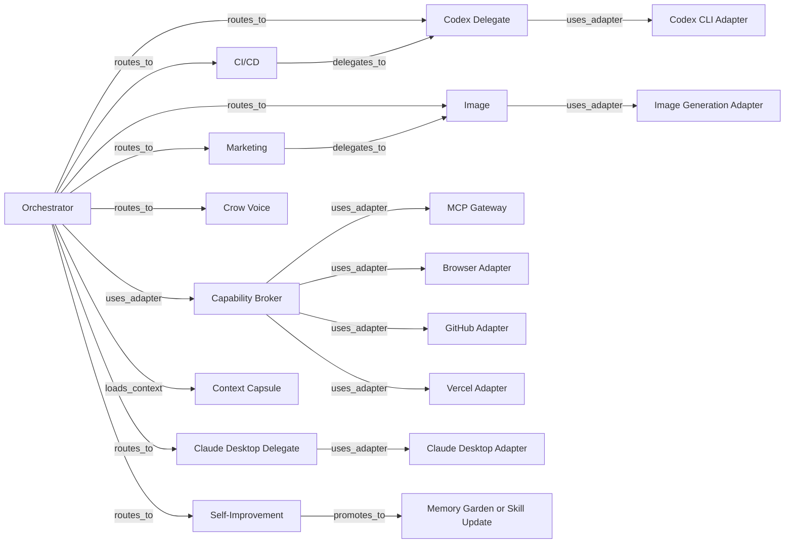

# Skill Map

Derived View. Source of truth: root `SKILL.md` files.

Use this map for semantic routing and progressive disclosure. Load the smallest useful skill set first, then load support files only when selected skills require them.

Do not use a vector database, embedding index, or hidden retrieval layer for v1 routing. Use semantic markdown: names, descriptions, trigger language, declared edges, and context capsules.

## Edge Types

| Edge | Meaning |
| --- | --- |
| `routes_to` | Orchestrator selects a specialist skill. |
| `delegates_to` | Skill hands bounded work to another skill. |
| `uses_adapter` | Skill requires runtime, harness, channel, memory, or tool translation. |
| `loads_context` | Skill may need a context capsule or Memory Garden slice. |
| `evaluates_with` | Skill loads contract or rubric for acceptance. |
| `promotes_to` | Workflow can become durable skill, policy, rubric, contract, or Memory Garden knowledge. |

## Graph

## Routing Table

| Skill | Kind | Primary Triggers | First Load Unit | On-Demand Loads | Declared Edges |
| --- | --- | --- | --- | --- | --- |
| `crow-pet-orchestrator` | router | task intake, routing, policy, delegation, semantic capability binding | root `SKILL.md` | task record, policy, capability broker, context capsule, subagent workflow, contract, rubric | `routes_to` all specialists; `uses_adapter` `adapters/channels/telegram.md`, `adapters/memory/markdown-bounded.md`, `adapters/patterns/planner-generator-evaluator.md`, `adapters/patterns/capability-broker.md`, selected harness/tool adapters; `loads_context` task memory; `evaluates_with` contract/rubric |
| `crow-pet-codex-delegate` | specialist | coding, implementation, tests | root `SKILL.md` | subagent brief, Codex workflow, code example, contract, rubric | `uses_adapter` `adapters/harnesses/codex-cli.md`; `loads_context` repo/user memory; `evaluates_with` contract/rubric |
| `crow-pet-claude-desktop-delegate` | specialist | Claude Desktop prompt delegation | root `SKILL.md` | focus-safety policy, desktop workflow, contract, rubric | `uses_adapter` `adapters/harnesses/claude-desktop.md`; `loads_context` target conversation context; `evaluates_with` contract/rubric |
| `crow-pet-cicd` | specialist | failing checks, CI, deployment loops | root `SKILL.md` | fix-CI workflow, CI example, contract, rubric | `delegates_to` `crow-pet-codex-delegate`; `uses_adapter` `adapters/tools/github.md`, `adapters/tools/vercel.md`, selected harness adapter; `loads_context` repo/deployment memory; `evaluates_with` contract/rubric |
| `crow-pet-marketing` | specialist | briefs, copy, campaigns, launch content | root `SKILL.md` | brand map, marketing workflow, example, contract, rubric | `delegates_to` `crow-pet-image` for visuals; `loads_context` brand/audience memory; `evaluates_with` contract/rubric |
| `crow-pet-image` | specialist | image generation, image editing, visual assets | root `SKILL.md` | image brief, generation workflow, example, contract, rubric | `uses_adapter` `adapters/tools/image-generation.md`; `loads_context` brand/prior image memory; `evaluates_with` contract/rubric |
| `crow-pet-self-improvement` | specialist | corrections, failures, repeated approvals, learning | root `SKILL.md` | self-improve workflow, matching memory file, evaluation template, contract, rubric | `promotes_to` skill/rubric/contract/policy/Memory Garden note; `loads_context` task history; `evaluates_with` contract/rubric |
| `crow-pet-crow-voice` | speaking layer | fewer tokens, terse mode, status compression | root `SKILL.md` | compression workflow, example, contract, rubric | `uses_adapter` target adapters under `adapters/targets/`; `evaluates_with` contract/rubric |
